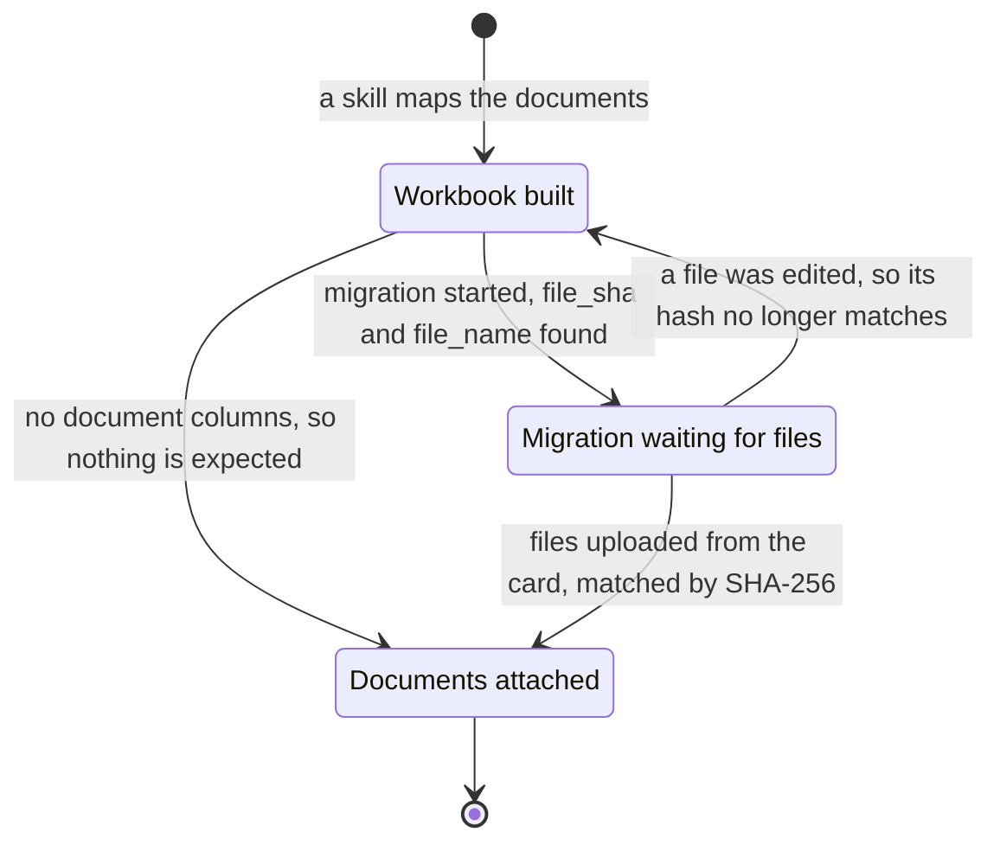

# Document uploading, end to end

Getting a customer's documents into their Worldmaker app takes three stages, in order: **map**,
**migrate**, **upload**. The skills in this plugin do the first; the user does the other two by hand in
Worldmaker. The document files stay on the user's computer the whole time a run is happening — they are
uploaded last, out of the migration itself.

Drawn, so it can be shown to the user rather than described:

## Map — the skill

`upload-documents` builds the workbook, reading the assignment off the folder tree the
customer organised. It assumes the items are already in the app: the workbook attaches documents to them
rather than creating them.

A document is carried into the workbook as two columns and nothing else:

- **`file_sha`** — the SHA-256 of the file's bytes, lower-case hex. This is the document's identity.
  Names collide between item folders and paths change; the hash does neither.
- **`file_name`** — the file's name with its extension and no path: `SDS_2026.pdf`. This is a label, for
  the human reading the workbook and for the upload screen later.

## Migrate — the user, in Worldmaker

In the customer's app, go to the migration page and start a new migration as usual, giving it the
workbook the run produced.

The migration agent looks for `file_sha` and `file_name` on the sheets it reads. Finding them, it creates
the migration and marks those documents as still to come — the rows are in place, the files are not.
Without those two columns it has no documents to expect, which is what makes the column names worth
getting exactly right.

## Upload — the user, from the migration card

Each migration renders as a card, and one carrying documents shows a warning on it. Clicking the warning
opens a modal to upload the files, and that is where the user drags in the documents themselves.

Each uploaded file is matched to its row by SHA-256, so the folders the documents were organised into no
longer matter at this point, and neither does renaming them. What matters is that the bytes are the same
ones the workbook was built from. A document edited or re-exported after a run hashes differently and
will not match — rebuilding the workbook from the current files is the fix.

## What the migration expects of a workbook

Three expectations shape every column, and they are worth understanding rather than memorising, because
they are what a correction has to preserve:

- **It finds items, it does not create them.** In a document workbook the item already exists, so the
  identifier column has to hold a value the app can look that item up by — the column the app itself
  indexes, spelled the way the app spells it. An identifier that only makes sense to the customer
  resolves to nothing.
- **It expects the files later, not now.** A row carries `file_sha` and `file_name`. Nothing in the
  workbook points into storage, because at migration time the file is not there yet.
- **It reads the app's own vocabulary.** Sheet names, column names and document template names are matched
  against the app's schema, so a run works from that vocabulary rather than the customer's wording — and
  the user is the one who supplies it. A name the app does not have resolves to nothing.

The layout that satisfies these is
`${CLAUDE_PLUGIN_ROOT}/skills/upload-documents/references/DOCUMENT_WORKBOOK_FORMAT.md`.

## Where the user usually needs a hand

Dragging a folder into the conversation so a run can read it; finding the finished workbook in the
session directory; starting the migration with it; and finding the same document files again at the
upload stage, which can be days later. Offer that help as it comes up rather than waiting to be asked.
