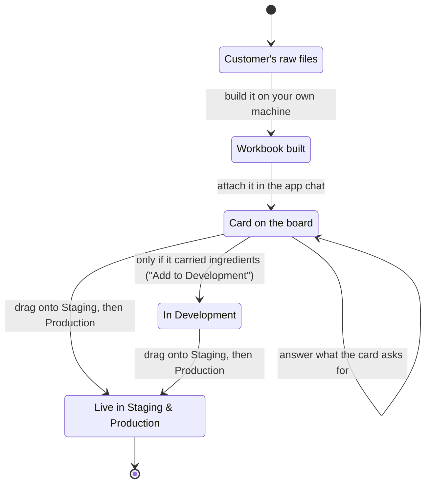

# Migrations: getting a customer's data into their app

The whole journey, in order, from a customer's files to records and documents live in
Production. Everything here happens in the Worldmaker web app — `{WORLDMAKER}` — except
building a document workbook, which is `{LOCAL}` and marked where it comes up.

> **A note on the word "migration."** In this product a *migration* means moving a
> customer's data into their app. Engineers also use the word for database schema changes
> (the `supabase/migrations/` folder in the codebase). Those are unrelated, and nothing in
> this guide is about them.

---

## What a migration actually is

Data never gets typed straight into a customer's app. It travels a fixed path, and every
part of it has one job:

1. **A workbook** — one Excel file that says, sheet by sheet, exactly what should exist in
   the app. It comes from one of three places: the customer hands you one, Worldmaker
   generates one out of the old Worldover app, or — for documents — you build one on your
   own machine.
2. **The app's assistant** — the chat inside the customer's app. You attach the workbook
   there; it reads the app's own structure and writes a **plan**: the precise list of
   records to create.
3. **A card** — the plan appears as a card on the app's **Environments** board. The card is
   the thing you move. It may ask you for some answers first.
4. **The environments** — **Development**, **Staging**, **Production**. A card is dragged
   onto Staging and onto Production. Development is where the cards wait, and it is what
   the assistant checks the plan against — but a card is only ever *added* to Development
   when it carries ingredients that needed matching. See Step 6.

Three things are worth knowing before you start, because they explain most of the behaviour
you will see:

- **Nothing is ever deleted.** Applying a card adds new records and updates records that
  already exist. It never removes anything, and the same card can safely be applied twice.
- **A card refuses to move while it still has questions outstanding.** Unmatched ingredients
  and un-uploaded documents both block it. That is deliberate — it stops half-finished data
  reaching a customer.
- **There is no "new migration" button.** A workbook enters the app by being attached in the
  app's chat, and a card appears because the assistant published one.

Here is the whole journey in one picture:

---

## Before you start

**Have these ready:**

- **The customer's files.** Whatever they sent — a zip, spreadsheets, Word documents, PDFs,
  a system export. Put them all in one folder on your computer before you begin.
- **The customer name and the app name.** Apps are one repo each, named `<customer>-<app>`,
  under the `WorldoverProd` GitHub organisation. Customers often have several apps, so know
  which one you are loading.
- **Access to the app in Worldmaker**, including its chat and its Migration page.
- **Claude Code** on your own machine. Use **Code**, not Cowork — Cowork does not have the
  tools these skills need.

**Have the local tooling installed** if you are building a document workbook. The run checks
for it before it starts anything and stops with a plain explanation if something is missing;
[the local guide](../LOCAL/DOCUMENT_UPLOAD.md) lists what is needed and what each piece
blocks. Ask engineering rather than working around it.

**Know where the board is.** In the project editor, open the **Settings** tab, then choose
**Migration** in the left sidebar. That page holds the Environments board and everything
else in this guide.

Across the top of that page, each environment shows a status pill — **DEPLOYED**, **NOT
DEPLOYED** or **CHECKING** — with **Preview Staging** and **Preview Production** buttons
beside them. Those pills matter later: documents cannot be uploaded until both Staging and
Production are deployed.

**Set aside enough time.** A migration is not a single sitting. Reading a few hundred
documents takes a while, you will be asked to confirm many decisions, and the document
upload at the end often happens days after the workbook was built. Keep the customer's
original files where you can find them again.

---

## Step 1 — Work out which kind of migration this is

Two routes. Read the question as *"where is the data coming from, and does the thing it
attaches to already exist in the app?"*

**A) The customer is on the old Worldover app.**
Worldmaker can pull their organisation's data out and build the workbook for you. Go to
Step 2A.

**B) The items are already in the app, and you are attaching documents to them.**
Safety Data Sheets, Certificates of Analysis, spec sheets — a folder of files that belong
against items that already exist. This is a **document migration**. Go to Step 2B.

**Documents can also travel with the items that carry them**, in one workbook and one card:
the data sheets carry `file_name` and `file_sha` columns, so the same card creates the items
and asks for their files. Running them separately is the default — each half is easier to
review and to re-run — but combined is valid and saves a round trip when you are loading
items and their documents in the same sitting.

When you do run them separately, the document half needs the items to exist **and to be
visible in Development** first. See "Before a document migration on a live customer" below.

**If the customer has handed you a finished workbook of their own**, skip to Step 4 — but
read Step 3 first, because the same checks apply. There is no fixed shape it has to be in:
a workbook from any other system is negotiated with the assistant when you attach it, and
only exports from the old Worldover app carry guaranteed columns.

**If the customer sent raw files and the items are not in the app yet**, there is currently
no local skill that turns those into a data workbook. That route was retired. The workbook
has to come from the customer, or from Step 2A if they are on the old Worldover app.

---

## Before a document migration on a live customer

A document workbook is built against the items the app can see in **Development**. For a
customer already live in Production, Development is usually empty or out of date — so the
export in Step 2B would describe items that are not the customer's real ones.

Make Development mirror Production first:

1. On the Migration page, use **Reset Database** on Development.
2. Drag the **Production data** tile from the Production column onto Development.

**Reset Database cannot be undone.** It deletes that environment's app data — accounts,
organisation access and the deployed app itself are kept. Say so, and get an explicit yes,
before anyone presses it.

The reset is what makes this a mirror. Copying Production down on its own is *additive* —
nothing is deleted — so a Development holding stale items ends up holding both sets, and the
export then reports identifier collisions that are not real.

---

## Step 2A — Generate the workbook from the old Worldover app

1. On the Migration page, click **Import from Worldover** in the toolbar.
2. A modal opens: *"Pull an organisation's data out of the old Worldover app into a
   spreadsheet, ready to import. Pick the organisation and we'll build it for you — it keeps
   running if you leave this page."*
3. Search for the organisation and click **Generate**.
4. A small floating panel tracks it: **Fetching your data from the old Worldover app…**,
   then **Building your spreadsheet…**, then **Finishing up…**. Large organisations take a
   while. You can leave the page; it keeps going.
5. When it finishes it says *"Your spreadsheet is ready. Download it, then attach it in the
   app chat and ask the assistant to import it into Development."* Click **Download file**.
6. If it fails you get **Export failed** and a **Try again** button.

That download is your workbook. Go to Step 3.

---

## Step 2B — Build a document workbook

A document migration needs one extra thing first: **the app's own vocabulary**. A document
cannot be filed correctly unless you know the app's words for things — which document types
it has ("Safety Data Sheet (SDS)"), which kinds of item they attach to, and which section of
an item's Documents tab each one sits in. That list only exists inside the app, so you ask
the app for it.

### First, export the vocabulary and the item list — `{WORLDMAKER}`

`{WORLDMAKER}`: the assistant below is you, and this export is the
`worldover-export-data-for-document-upload` skill. Walk the user through what it will ask
them, then offer to run it.

1. Open the customer's app in Worldmaker and go to the chat.
2. Type **/export-document-data**, or ask in plain language — *"export the document upload
   workflow and items for this app"*.
3. It shows you a table of the kinds of item that can carry documents, with how many of each
   the app holds. **Tell it which ones your documents are for.** Any subset is fine.
4. For each kind you chose, it proposes the **customer identifier** — the value the customer
   calls an item by, such as a code or a part number — and says which column it picked and
   why. **Check it and approve or correct it.** This is what your document folder names will
   be matched against.
5. If two items share the same identifier value, it reports the clash with real examples.
   You have three ways out and the choice is yours: fix it in the app and have the assistant
   re-check, leave that item out, or accept the risk and carry on.
6. It hands you **two downloadable files** — a **workflow** file (the app's document types,
   item kinds and sections) and an **items** file (one row per item, with its identifier and
   which template it is on).

**Download both and keep them together.** They carry a matching short code in their names,
so a workflow paired with a stale item list is obvious at a glance.

### Then build the workbook — `{LOCAL}`

This part happens in Claude Code on your own machine, and it is a guide in its own right:
**[Building the document upload workbook on your own machine](../LOCAL/DOCUMENT_UPLOAD.md)**.

In outline: you start the `upload-documents` skill, hand it the two export files and the
documents folder, and work with it through mapping the folder, setting aside what nobody
wants, grouping the documents by form, eyeballing those forms, and approving a review page.
It ends with `DOCUMENT_UPLOAD_WORKBOOK.xlsx` written beside your documents folder.

> **Do not edit or re-export the documents after this point.** Each row identifies its file
> by a fingerprint of the exact bytes. An edited or re-saved file has a different
> fingerprint and will not be recognised at upload time. If a document does change, the fix
> is to rebuild the workbook from the current files.

---

## Step 3 — Check the workbook before you hand it over

Open the file and spend ten minutes on it. Fixing a workbook is far cheaper than fixing data
that has already reached a customer.

1. **Read the `README` sheet first.** It says what each sheet feeds and how the run's work
   broke down.
2. **On a document workbook, read `IGNORED_FILES` and `FILES_WITH_ISSUES`.** Every document
   that did not make it into a data row is on one of those two sheets, with the reason.
3. **Spot-check the rows the run flagged.** It ends by naming what it had least evidence for.
   Check those specifically.
4. **Check the identifiers look like the customer's own codes**, not something invented.
5. On a document workbook, confirm each data sheet carries a `file_name` and a `file_sha`
   column. Those two are what make the app ask you for the files later; without them it will
   not know any documents are coming.

---

## Step 4 — Hand the workbook to the app's assistant — `{WORLDMAKER}`

The workbook enters the app one way only: **you attach it in the app's chat.** There is no
upload button for it on the Migration page.

`{WORLDMAKER}`: the assistant taking the workbook is you. Once it is attached, say what the
import involves and offer to do it.

1. Open the customer's app in Worldmaker and go to the chat.
2. Either use the composer's **+** menu and choose **Add Files**, or simply **drag the file
   onto the chat panel** — an overlay appears reading *"Drop files to attach"*.
3. The file shows as a chip on your message. Ask the assistant to import it — *"import this
   workbook"*, *"load this spreadsheet into dev"*.

**Expect a conversation, not a button press.** The workbook is in the customer's shape and
the app has its own shape, and closing that gap takes decisions only you can make. The
assistant batches its questions and proposes an answer for each, but it will ask about
things like:

- **Scope** — all of it, or only part?
- **Identity** — is any of this customer's data already in the app? How records are
  identified decides whether a second run updates the first import or duplicates it.
- **Columns with no home** — drop them, or is the app missing a field?
- **Units and conventions** — percentages or fractions, which currency, what a bare date means.
- **Categories and statuses** — the customer's values have to land on the app's fixed list.
- **Required fields the workbook does not have.**

Answer these carefully. The assistant's work is checked for structural mistakes before
anything is written, but **a wrong mapping passes every check and reports success** — and
the customer finds it weeks later in a specification that quietly says the wrong thing.

When it is done, the assistant **publishes a card** and tells you so. If it warns that some
documents will not open yet, that is expected — see Step 5B.

---

## Step 5 — Answer what the card asks for

Go to the Migration page. The **Environments** board has three columns — **Development**,
**Staging**, **Production**. Your card is on the shelf inside Development, headed **Ready to
move**.

A card shows a coloured state label, its name, how many records it holds, a two-line summary,
and green **Staging ✓** / **Live ✓** chips once it has been applied.

| Label on the card | What it means |
| --- | --- |
| **Needs your attention** | Ingredients still have to be matched |
| **Waiting for documents** | Document files still have to be uploaded |
| **Ready to add to Development** | Every ingredient is matched, but the matches are not yet written into the plan. Only ever appears on a card that carried ingredients |
| **Ready to apply** | It can be dragged onto Staging or Production |
| **Apply failed** | The last apply did not finish — the reason is on the card |
| **Development changed** | Somebody edited the data in Development after this card was made |
| **Applied to Staging & Production** | Done |

A card with outstanding work **cannot be dragged**. Hover it and the tooltip says why. If you
try anyway, a red banner appears under the board naming the card and what it is waiting for.

### Step 5A — Match the ingredients

Ingredients are not records the migration can create. They are references into an external
regulatory catalogue, and which catalogue entry the customer means by "Glycerin (veg)" is a
judgement about *their* vocabulary. So the app asks you.

If the card reads **"37 ingredients unresolved"**, click it. The **Resolve Ingredients**
modal opens with three groups — **Resolved**, **Unknown** and **Unresolved** — each with a
count, with Unresolved open by default.

1. **Check the naming convention** at the dropdown up top. Ingredient names are unique only
   within one convention (INCI by default), so a customer working outside INCI must have
   theirs selected or nothing will resolve properly.
2. Click **Resolve N exact matches** to settle everything the catalogue matches exactly on
   name, CAS or EC number. Anything ambiguous is deliberately left for you.
3. Work through the rest one at a time. Each row expands to show suggested options, and
   **Search the catalogue** takes a name, a CAS number or an EC number. Ambiguous rows say
   why in brackets — *"Several exact matches"*, *"Its name and code disagree"*.
4. For an ingredient the catalogue genuinely does not hold, use **Mark ingredient as
   unknown**. That resolves it to the catalogue's Unknown entry, so the formulation records
   no ingredient rather than the wrong one. Only use it when you are sure.
5. **Accept the closest hit for N remaining** exists, and it is a last resort. Those are
   guesses, some will be wrong, and a wrong ingredient id is wrong regulatory data about a
   formulation. Each is badged **guessed** in the list so you can find it again, but they
   reach Development as they stand.

Any answer can be taken back with **Unresolve** until the card has been added to Development.
The link stays on the card after the count hits zero — it then reads **"Review N matched
ingredients"** — so you can reopen the list and re-check your guesses.

### Step 5B — Upload the document files

If the card reads **"12 documents to upload"**, the app has the records but not the files.
Click it to open the **Documents to upload** modal.

**Both Staging and Production must be deployed before you can upload** — the files go to
each of them together, and the modal shows the status of both.

Drop the files into the panel, or use **or choose a whole folder**. Each file is matched to
its row by its fingerprint, so the folders they came from no longer matter and neither do
their names — only that the bytes are the same ones the workbook was built from. *Files this
card didn't ask for are ignored, so a whole folder is fine.*

Each row ticks over to **✓ uploaded** as it lands, and a bar shows progress while it uploads
to Staging and Production. Anything that fails is listed with its reason and stays
outstanding. When the count reaches zero the modal reads *"Every document on this card is in
Staging and Production. The card is free to move."*

For the full detail of this step — what the modal shows, what happens to the files, and what
to do when one will not match — see [Document uploads](DOCUMENT_UPLOADS.md).

---

## Step 6 — If your card carried ingredients, add it to Development

**Skip this step unless your card asked you to match ingredients.** Despite the name, this
is not a general "load the data" step, and it is not offered on every card. A document
migration, or any card with no ingredients in it, has no **Add to Development** button at
all — it goes straight from Step 5 to Step 7.

What the button actually does is write your ingredient matches into the plan. Until that
happens the plan still refers to those ingredients by the customer's own words rather than
by catalogue id, and the card cannot be applied anywhere. That is the only reason the step
exists.

1. On the card, click **Add to Development**. It appears once the unresolved count reaches
   zero.
2. That sends a message to the assistant in the app chat, carrying your matches. Watch the
   chat: the assistant writes the matches onto the records, checks everything again, and
   refuses to write anything at all if something is wrong. If the assistant is mid-turn on
   something else, wait for it to finish first.
3. When it completes it reports, per kind of record, how many were **new** and how many were
   **updated**. Read that report rather than treating "done" as the answer.

**The button disappears as soon as you press it** — one ask per card. If the assistant never
picked the request up, reload the Migration page and the button comes back, as long as the
matches still have not been written. Once they have, the card turns draggable and the button
is gone for good, which is the outcome you want.

**Then check the data in the app.** Open a few records in Development and confirm they look
right — values in the right fields, the right units. This is the last environment where a
mistake is cheap.

---

## Step 7 — Move it to Staging, then to Production

The same card carries on. There is no "publish everything" button — a card is the only way
data moves upward.

1. **Grab the card by the grip on its left edge and drop it on Staging.** The drop area
   confirms: *"Release to review & add — nothing gets deleted."*
2. Worldmaker runs its safety checks first, ticking them off as they pass:
   - *Target environment (staging) readable*
   - *Script's data fits the target's schema*
   - *Rows can be written in an order the target accepts*
   - *Uploaded document files present in staging* (only when the card carries documents)
   A failure stops there and explains itself, with a **Re-check** button.
3. Then it shows the **review**: a **Will apply** table with the total row count, and per
   kind of record how many are **new** and how many are **updated** in that environment. Two
   findings hard-block the apply, each with a button that hands it back to the assistant:
   references to records that do not exist yet, and Development having changed since the
   card was prepared.
4. Click **Add to staging**.
5. Watch it run. Records are written first (**Applying records**), then the document files
   are put in place (**Placing documents**). When it finishes you get a green summary —
   records added and updated, and how many document files were copied.

**Production has two extra gates.** When you drop a card on Production you must **type the
project name exactly** to confirm you are writing to live data, and before anything is
written Worldmaker takes a **restore point** of Production (*"Preparing a production
snapshot…"*). If the snapshot fails, nothing is written and you are offered **Retry
snapshot** or **Apply without a snapshot** — the latter is recorded against the card.

**Keep the browser tab open while an apply runs.** It streams through your tab. You can
navigate around the app — a small floating panel follows you with the progress and a **View
details** link — but closing the tab interrupts it.

Two more things on this board worth knowing:

- **Production data** is a permanent tile in the Production column. Drag it onto Staging or
  Development to copy live data back down — useful for reproducing a problem. It is
  additive too: nothing is deleted.
- **Restore points** sit below the Production column. One is taken automatically before
  every production apply, and you can take one manually with **Take snapshot**. From the
  cog you can download one or restore Production from it — a restore is guarded by a
  countdown, a summary of how many records created since the snapshot would be deleted, and
  typing the project name.

---

## Step 8 — Confirm it landed

- Use **Preview Production** on the Migration page and check a handful of records end to end.
- Open a document and confirm it actually opens. Records can land before their files do, so
  a document that will not open usually means its file has not been placed yet rather than
  that the import failed. The apply's summary tells you if any files were not copied.
- Tell the customer what did **not** come across. Both the workbook run and the assistant
  report their exclusions; pass those on rather than letting the customer discover them.

---

## Troubleshooting

**Problem: the card will not drag.**
It has outstanding work. Hover it — the tooltip says which. Either documents still have to
be uploaded, or ingredients still have to be matched, or it needs adding to Development
first. Trying to drop it shows a red banner under the board saying the same thing.

**Problem: the card says "Development changed".**
Somebody edited the data in Development after the card was published, so it is now out of
date. Ask the assistant in the app chat to update the migration. It re-publishes under the
same name, and your existing answers are kept.

**Problem: the card says "Apply failed".**
The reason is on the card. Click **Ask the assistant to fix this** — it opens a chat
conversation named after the card with the error already written out, and asks for a fix and
a re-publish. If the apply was interrupted rather than rejected, the records it already
added are still there and you can drag the card again to carry on from where it stopped.

**Problem: the apply is blocked before it starts.**
Two blockers are common. *"References records that don't exist yet"* means the card depends
on records the target environment has not got — use **Ask the assistant to rebuild this**.
*"Development changed since this was prepared"* means the source data moved — use **Ask the
assistant to update this**.

**Problem: a document file will not upload, or is still reported as outstanding.**
Two common causes. The file was edited or re-exported after the workbook was built, so its
fingerprint no longer matches — rebuild the workbook from the current files. Or the upload
did not fully land: re-open the card's **documents to upload** window, drop those files in
again, and re-check.

**Problem: the upload panel says documents cannot be uploaded.**
Both Staging and Production have to be deployed first — the files go to both together. The
panel shows which one is not deployed, and the pills at the top of the Migration page say
the same.

**Problem: the migration did not ask me for any documents.**
The workbook had no `file_name` and `file_sha` columns, so the assistant had no documents to
expect. Check those column names are spelled exactly like that on every sheet carrying
documents, and attach the workbook again.

**Problem: a document type came out wrong, or a document was filed against the wrong item.**
Fix it in the workbook and have the assistant re-publish under the **same** card name.
Re-publishing the same card keeps the ingredient matches and the document uploads you have
already done. Publishing under a new name creates a second card that asks for everything
again — and orphans the files you already uploaded.

**Problem: the data imported cleanly but nothing shows in the app.**
Records can be valid and still invisible — usually the item is not linked to a template, or
a field is not placed on that template's layout. Report exactly what you expected to see and
where; this one needs the assistant to trace it.

**Problem: the production snapshot failed.**
Nothing has been written. Use **Retry snapshot**. Only use **Apply without a snapshot** if
you accept going ahead with no restore point — the choice is recorded against the card.

**Problem: something went wrong while building the workbook.**
Missing tooling, an illegible folder tree, files that would not read — all of that belongs to
the local run. See [the local guide's troubleshooting](../LOCAL/DOCUMENT_UPLOAD.md).

**Problem: I need to start again.**
Development (and Staging) each have a **Reset Database** button, which deletes that
environment's app data while keeping accounts, organisation access and the deployed app
itself. **It cannot be undone.** State what it deletes and get an explicit yes before
recommending it, and confirm which environment is meant. Production has no such button —
recover it from a restore point instead.

---

## Related guides

- [Document uploads](DOCUMENT_UPLOADS.md) — the document step in full detail.
- [Building the workbook on your own machine](../LOCAL/DOCUMENT_UPLOAD.md) — the Claude Code
  run that produces a document upload workbook.

---

## Open questions

These are parts of the flow this guide could not pin down from the material available. Check
them with engineering before relying on them.

- **Timings are not measured.** Nothing records how long an apply to Production takes on a
  real migration. Say it is unknown rather than estimating. What *is* known: the apply
  streams through the browser tab, so closing the tab interrupts it, and a card interrupted
  part-way keeps the records it already wrote — dragging it again carries on from there.
