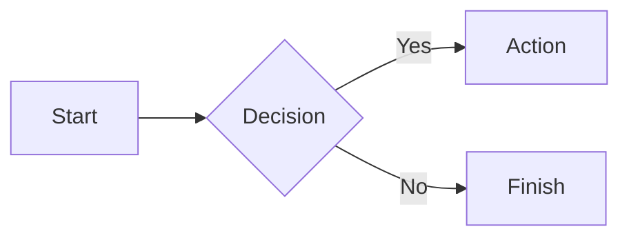
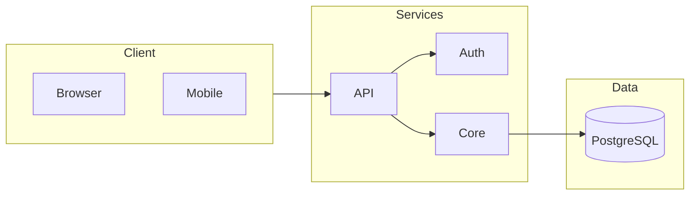
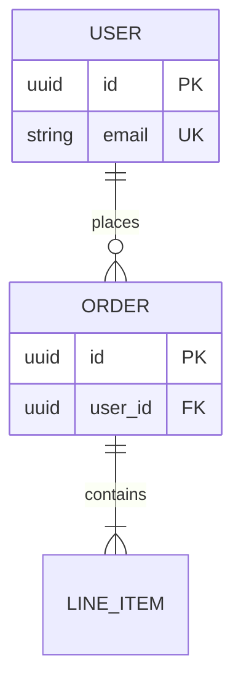
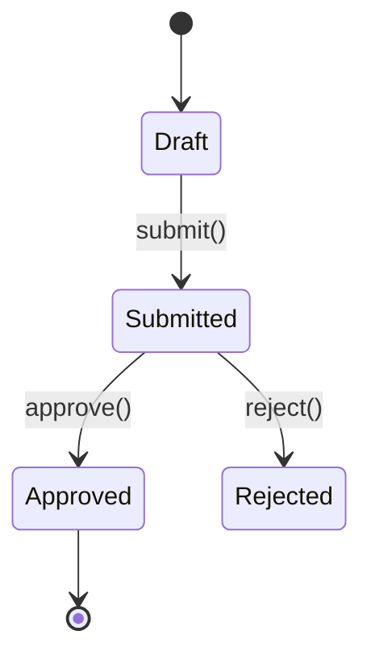

# Mermaid Diagrams

Generate diagrams in markdown that render in GitHub, GitLab, VS Code, Obsidian, Notion. Syntax verified against Mermaid v11.16 (2026).

## Quick Start

````markdown

````

## Quick Decision Tree

```
What to visualize?
├─ Process, algorithm, decision flow    → flowchart
├─ Database tables, relationships       → erDiagram
├─ OOP, type hierarchy, domain model    → classDiagram
├─ State machine, lifecycle             → stateDiagram-v2
└─ System architecture, services        → flowchart + subgraphs
```

Default to `flowchart` when unsure — it handles most "draw the system/process" requests. Prefer plain flowchart + subgraphs over `architecture-beta`/C4 unless the user asks for those specifically, since flowcharts render everywhere.

## Diagram Types

| Type | Declaration | Best For | Status |
|------|-------------|----------|--------|
| Flowchart | `flowchart LR` / `flowchart TB` | Processes, decisions, data flow | Stable |
| ER | `erDiagram` | Database schemas | Stable |
| Class | `classDiagram` | Types, domain models | Stable |
| State | `stateDiagram-v2` | State machines | Stable |

## Common Patterns

### System Architecture



### Database Schema



### State Machine



## Syntax Quick Reference

### Flowchart Nodes

```
[Rectangle]  (Rounded)  {Diamond}  [(Database)]  [[Subroutine]]
((Circle))   >Asymmetric]   {{Hexagon}}
```

### Flowchart Edges

```
A --> B       # Arrow
A --- B       # Line
A -.-> B      # Dotted arrow
A ==> B       # Thick arrow
A -->|text| B # Labeled
```

### ER Cardinality

```
||--||   # One to one
||--o{   # One to many
}o--o{   # Many to many
```

## Gotchas That Break Rendering

These are the errors LLMs most often produce. Each one fails to parse or silently renders wrong:

1. **`end` is a reserved word in flowcharts.** A node named `end` (lowercase) breaks the parser because it terminates subgraphs. Use `End`, `e[end]`, or quote it. Same caution applies to nodes named `o` or `x` directly after an edge: `A---oB` parses as a circle-ended edge to `B`, not an edge to node `oB` — add a space or capitalize.

2. **Node IDs must not collide with subgraph IDs.** `subgraph Build` containing a node with ID `Build` throws "would create a cycle". Give the node a different ID and put the display text in brackets: `Compile[Build]`.

3. **Special characters need quotes.** Labels containing `(`, `)`, `[`, `]`, `{`, `}`, `:`, `;`, or starting with a number often break parsing. Wrap the label in double quotes: `A["Fetch (retry x3)"]`. Inside quoted labels, escape with HTML entity codes: `#quot;` for `"`, `#35;` for `#`, `#lt;`/`#gt;` for `<`/`>`.

4. **Comments use `%%` on their own line.** `%% like this`. Do not use `//` or `#`, and do not append `%%` comments to the end of a syntax line — inline trailing comments can break some diagram types.

5. **One diagram per code block, declaration first.** The first non-comment line must be the diagram type (`flowchart LR`, `erDiagram`, ...). A bare `%%{init: ...}%%` directive with no diagram after it fails to render.

6. **ER attribute blocks are line-based.** One attribute per line inside `ENTITY { }` — semicolon-separated attributes on one line fail. Multiple key constraints are comma-separated: `uuid user_id FK, UK`.

## Best Practices

1. **Choose the right type** — Use the decision tree above
2. **Keep focused** — One concept per diagram; split diagrams over ~20 nodes
3. **Use meaningful labels** — Not just A, B, C
4. **Direction matters** — `LR` for flows, `TB` for hierarchies
5. **Group with subgraphs** — Organize related nodes

## Reference Documentation

Read the matching reference before generating anything beyond a basic diagram of that type:

| Read | Before generating |
|------|-------------------|
| [references/FLOWCHARTS.md](references/FLOWCHARTS.md) | Flowcharts with shapes, subgraphs, styling, ELK layout, animated edges |
| [references/CLASS-ER.md](references/CLASS-ER.md) | Class diagrams (generics, annotations, namespaces) or ER schemas |
| [references/STATE-JOURNEY.md](references/STATE-JOURNEY.md) | State machines (composite, fork/join, choice) or user journeys |

## Resources

- **Official Documentation**: https://mermaid.js.org
- **Live Editor**: https://mermaid.live
- **GitHub Repository**: https://github.com/mermaid-js/mermaid
