# Class & Entity Relationship Diagrams

Class diagrams model object-oriented structures. ER diagrams model database schemas and data relationships.

## Contents

- [Class Diagrams](#class-diagrams)
  - [Class Definition](#class-definition) — attributes, methods, visibility, return types
  - [Relationships](#relationships) — inheritance, composition, aggregation, cardinality
  - [Annotations](#annotations), [Generic Types](#generic-types), [Namespaces](#namespaces), [Notes](#notes), [Styling](#styling)
  - [Example: Domain Model](#example-domain-model)
- [Entity Relationship Diagrams](#entity-relationship-diagrams)
  - [Relationship Notation (Crow's Foot)](#relationship-notation-crows-foot)
  - [Entity Attributes](#entity-attributes) — PK/FK/UK, comments
  - [Relationship Labels](#relationship-labels)
  - [Examples: E-Commerce Schema, Multi-Tenant SaaS](#example-e-commerce-schema)

---

# Class Diagrams

## Basic Syntax

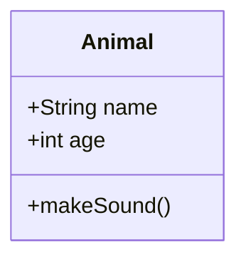

---

## Class Definition

### Attributes and Methods

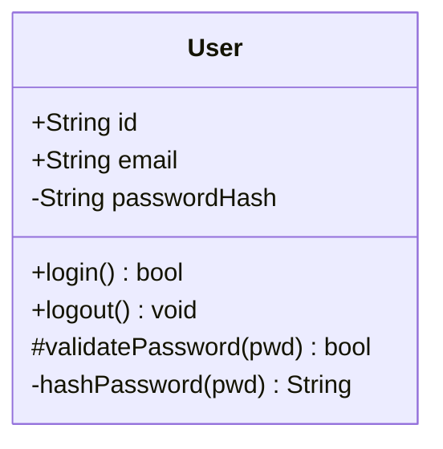

### Visibility Modifiers

| Symbol | Visibility |
|--------|------------|
| `+` | Public |
| `-` | Private |
| `#` | Protected |
| `~` | Package/Internal |

### Return Types

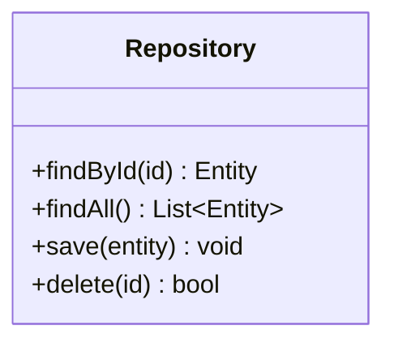

---

## Relationships

### Relationship Types

| Syntax | Relationship |
|--------|--------------|
| `<\|--` | Inheritance (extends) |
| `*--` | Composition (owns) |
| `o--` | Aggregation (has) |
| `-->` | Association |
| `..>` | Dependency |
| `..\|>` | Realization (implements) |
| `--` | Link (solid) |
| `..` | Link (dashed) |

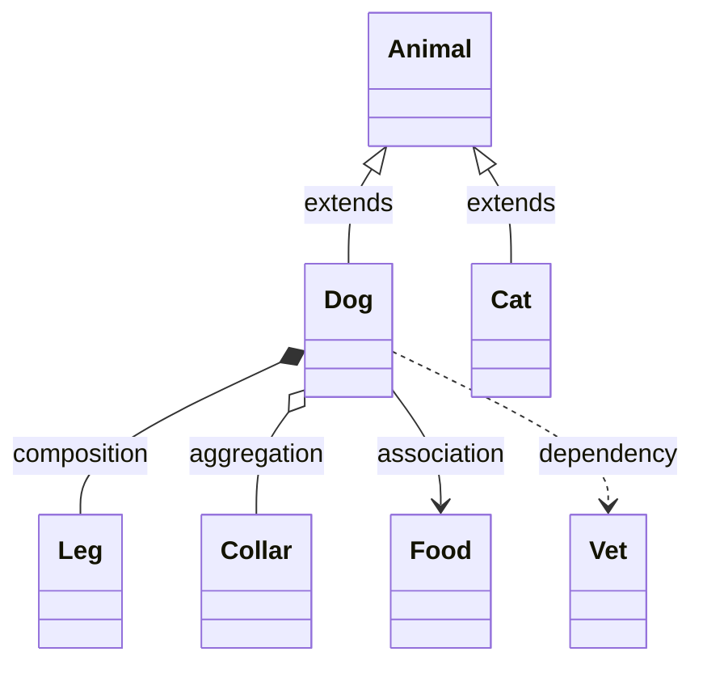

### Cardinality

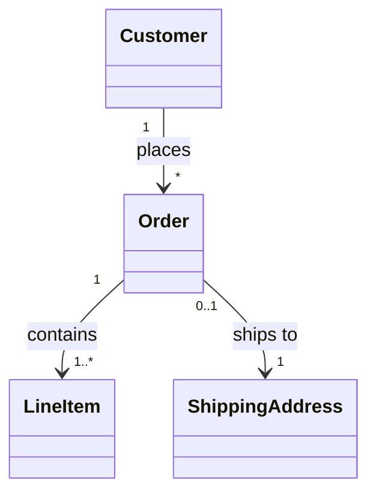

| Notation | Meaning |
|----------|---------|
| `1` | Exactly one |
| `0..1` | Zero or one |
| `1..*` | One or more |
| `*` | Many (zero or more) |
| `n` | Specific number |
| `0..n` | Zero to n |

---

## Annotations

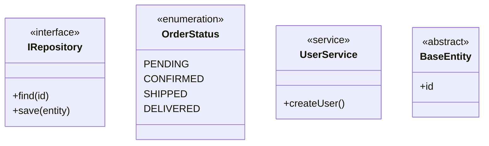

---

## Generic Types

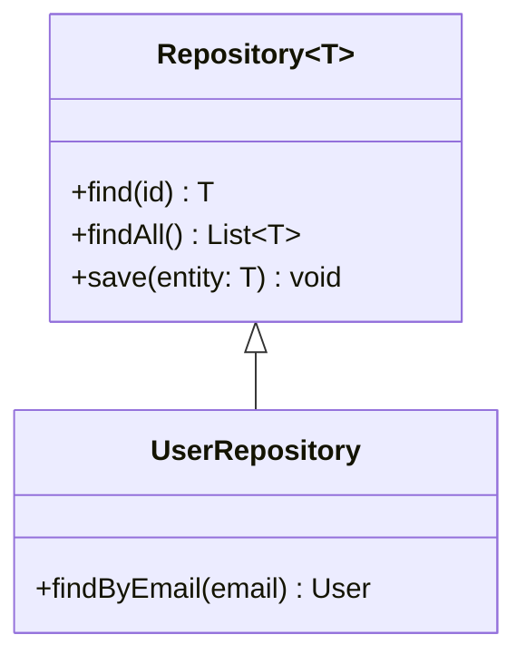

---

## Namespaces

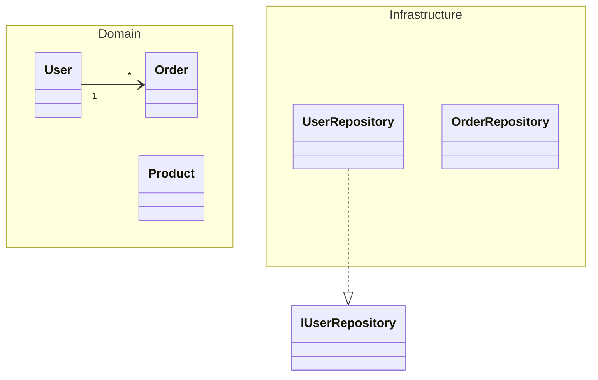

---

## Notes

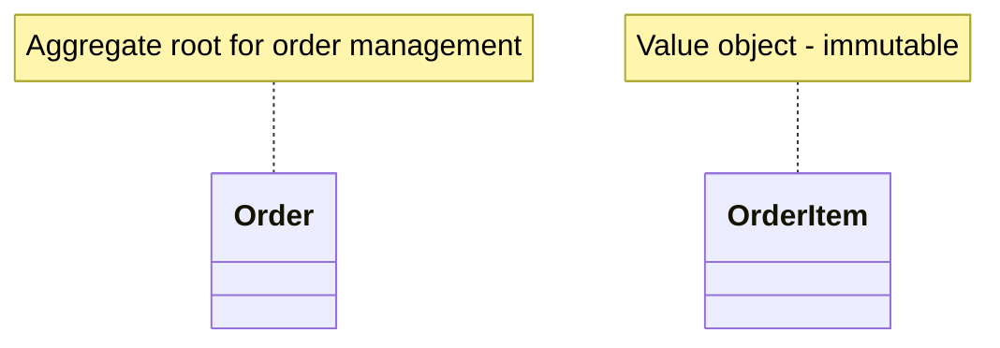

---

## Styling

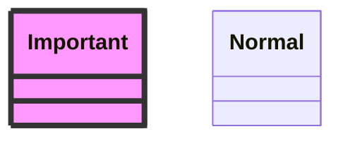

---

## Example: Domain Model

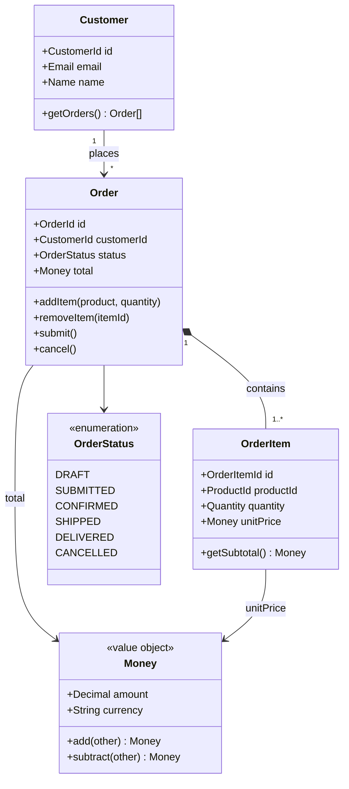

---

# Entity Relationship Diagrams

## Basic Syntax

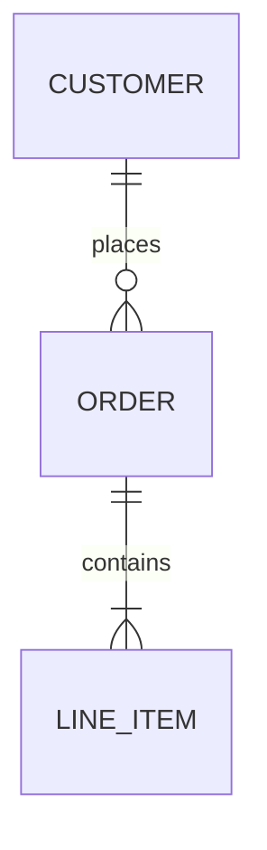

---

## Relationship Notation (Crow's Foot)

### Cardinality Symbols

| Left | Right | Meaning |
|------|-------|---------|
| `\|o` | `o\|` | Zero or one |
| `\|\|` | `\|\|` | Exactly one |
| `}o` | `o{` | Zero or more |
| `}\|` | `\|{` | One or more |

### Line Types

| Type | Syntax | Meaning |
|------|--------|---------|
| Identifying | `--` | Strong relationship |
| Non-identifying | `..` | Weak relationship |

### Common Patterns

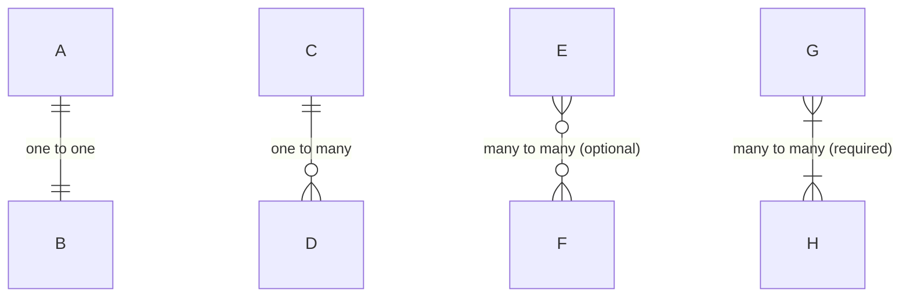

---

## Entity Attributes

### Basic Attributes

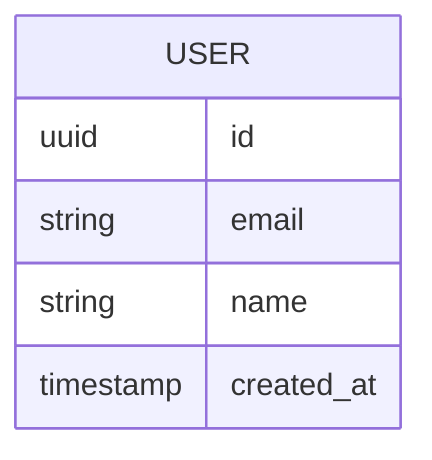

### Attribute Modifiers

| Modifier | Meaning |
|----------|---------|
| `PK` | Primary Key |
| `FK` | Foreign Key |
| `UK` | Unique Key |

One attribute per line — semicolon-separated attributes on a single line fail to parse. Combine multiple key constraints with a comma: `uuid user_id FK, UK` (a space-separated `FK UK` fails).

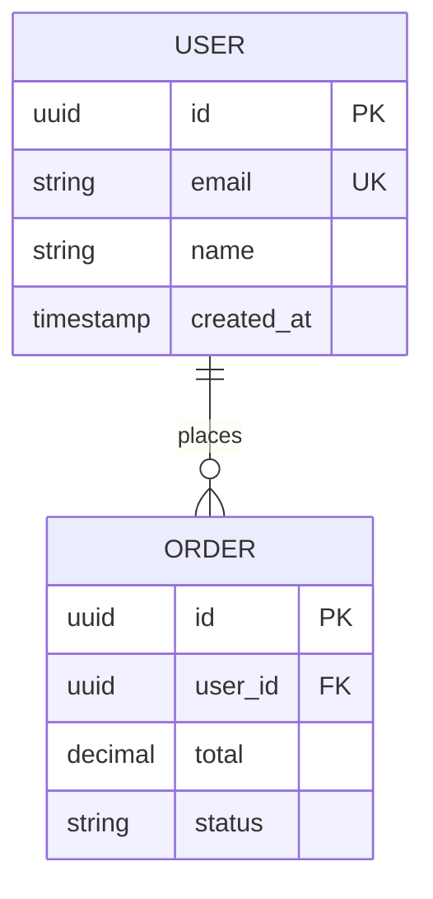

### Attribute Comments

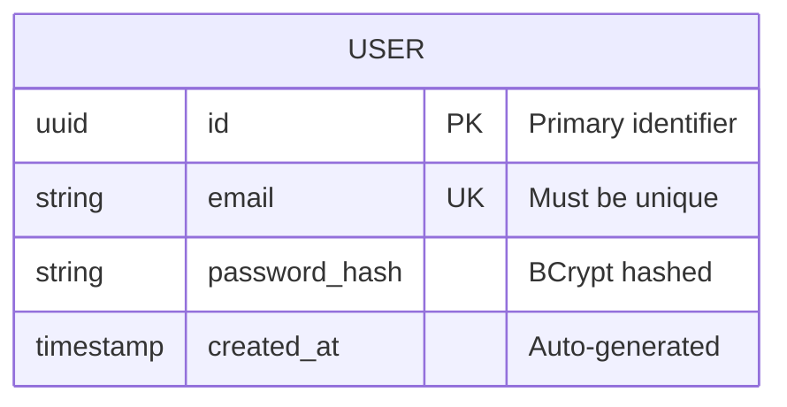

---

## Relationship Labels

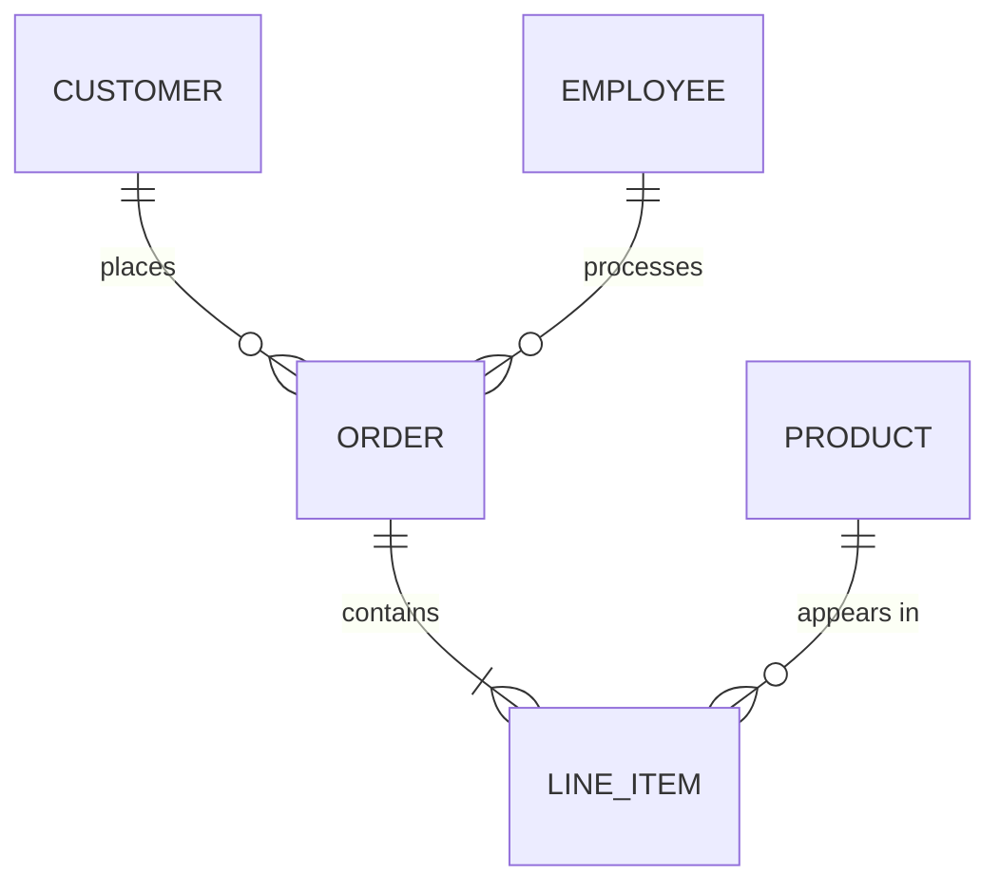

---

## Example: E-Commerce Schema

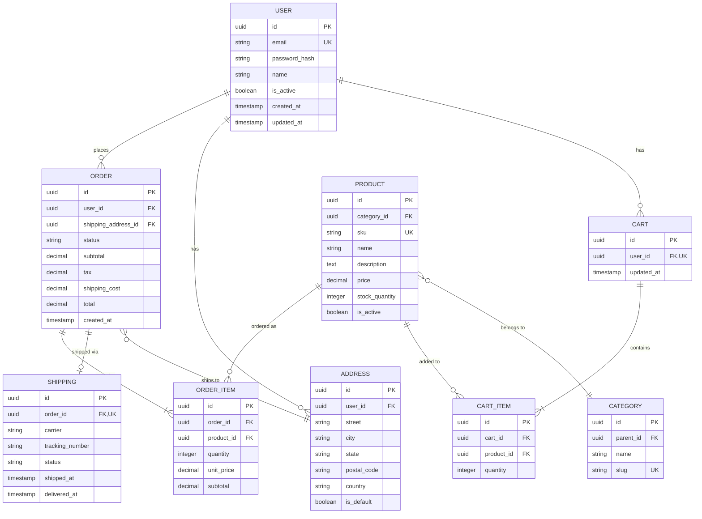

---

## Example: Multi-Tenant SaaS

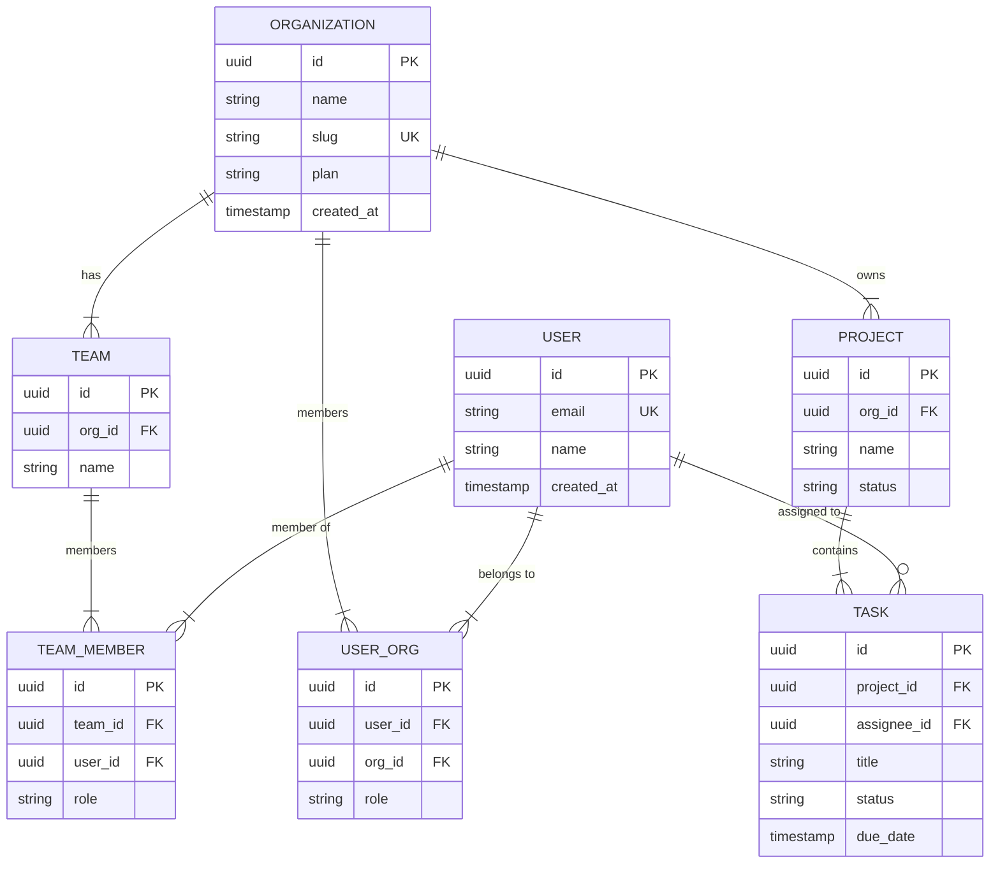
